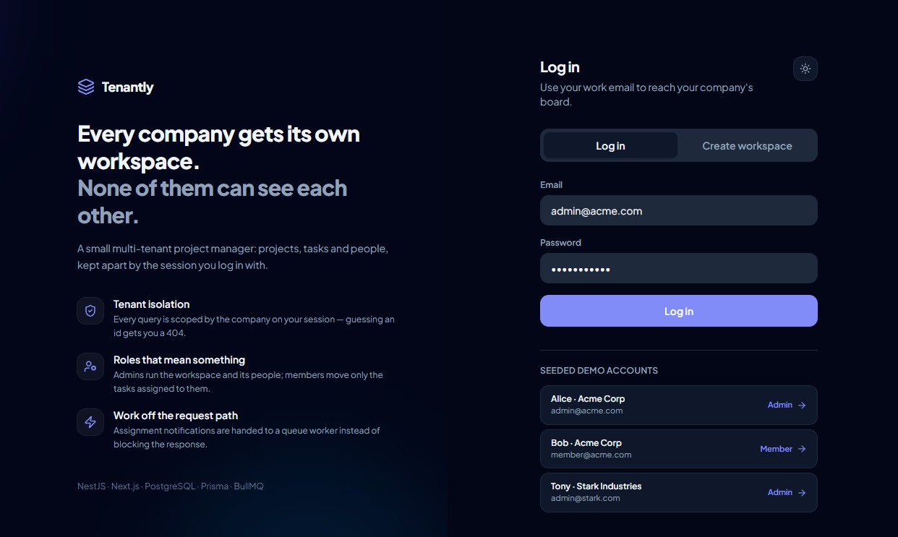
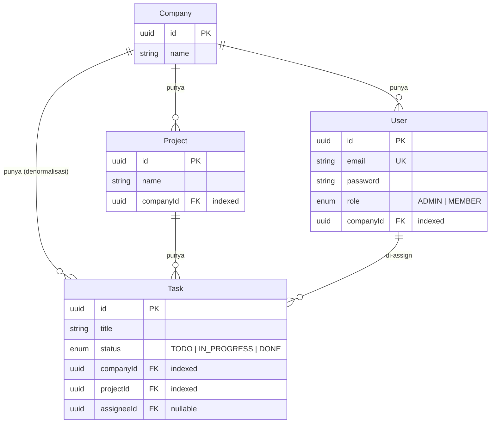

<!-- portfolio -->
<!-- slug: tenantly-multi-tenant-saas -->
<!-- title: Tenantly - Multi-Tenant Project Management -->
<!-- description: Multi-tenant SaaS project manager with session-scoped tenant isolation, Admin/Member RBAC, queue-backed notifications, and optimistic locking -->
<!-- image: https://raw.githubusercontent.com/daffa09/tenantly/master/hero.jpeg -->
<!-- tags: nestjs, nextjs, postgresql, prisma, bullmq, multi-tenancy, rbac -->

# Tenantly — Multi-Tenant Mini Project Management



Mini Asana/Trello untuk banyak perusahaan dalam satu instance. Setiap tenant punya project, task,
dan user sendiri, dan **tidak pernah** bisa melihat data tenant lain.

**Stack:** NestJS (API) · Next.js (web) · PostgreSQL + Prisma · BullMQ/Redis (async job).

Kenapa: NestJS memberi satu tempat eksplisit (module/guard/interceptor) untuk aturan tenant dan RBAC,
alih-alih tersebar di controller. Prisma memberi skema tunggal yang terbaca sebagai dokumentasi
sekaligus migration yang ter-version. BullMQ karena Redis sudah lazim ada di stack SaaS.

---

## Daftar Isi

1. [Cara Menjalankan](#1-cara-menjalankan)
2. [Akun Seed](#2-akun-seed)
3. [Skema Database & ERD](#3-skema-database--erd)
4. [Strategi Multi-Tenancy](#4-strategi-multi-tenancy)
5. [API](#5-api)
6. [RBAC](#6-rbac)
7. [Background Job](#7-background-job)
8. [Concurrency & Race Condition](#8-concurrency--race-condition)
9. [Testing](#9-testing)
10. [Keputusan Keamanan](#10-keputusan-keamanan)
11. [Yang Di-skip & Rencana Berikutnya](#11-yang-di-skip--rencana-berikutnya)
12. [Keputusan yang Masih Saya Ragukan](#12-keputusan-yang-masih-saya-ragukan)
13. [Peta Requirement](#13-peta-requirement)

---

## 1. Cara Menjalankan

### Opsi A — Docker (satu perintah, tidak butuh Postgres/Redis lokal)

```bash
docker compose -f docker-compose.dev.yml up --build
```

Stack ini berisi Postgres + Redis + API + Web, dan otomatis menjalankan
`prisma migrate deploy` lalu seed sebelum API start.

- Web: <http://localhost:3000>
- API: <http://localhost:3001>
- Swagger: <http://localhost:3001/api/docs>

> `docker-compose.yml` (tanpa `-f`) adalah file **production** — memakai Postgres eksternal,
> nginx gateway, dan image dari Docker Hub. File itu tidak akan jalan di mesin bersih;
> pakai `docker-compose.dev.yml` untuk mencoba.

### Opsi B — Manual (mode development)

Prasyarat: PostgreSQL dan Redis berjalan lokal.

```bash
cd backend
cp .env.example .env        # WAJIB isi JWT_SECRET — app menolak start tanpa itu
npm install
npx prisma migrate deploy   # `migrate dev` kalau skema berubah
npm run seed
npm run start:dev
```

```bash
cd frontend
npm install
npm run dev
```

### Migration

Migration ter-commit di `backend/prisma/migrations/`.

```bash
npx prisma migrate dev --name <nama>   # buat migration baru
npx prisma migrate deploy              # terapkan di CI/production
```

Setiap migration punya `down.sql` (dari `prisma migrate diff --to-empty`) karena Prisma tidak punya
`migrate down`. Rollback: jalankan `down.sql`, lalu `prisma migrate resolve --rolled-back <migration>`.

`schema.sql` dan `seed.sql` di root adalah salinan flat untuk di-paste manual ke psql saat deploy —
**bukan** sumber kebenaran, dan tidak dipakai oleh kedua opsi di atas.

---

## 2. Akun Seed

| Tenant | Role | Email | Password |
| :--- | :--- | :--- | :--- |
| Acme Corp | `ADMIN` | `admin@acme.com` | `password123` |
| Acme Corp | `MEMBER` | `member@acme.com` | `password123` |
| Stark Industries | `ADMIN` | `admin@stark.com` | `password123` |
| Stark Industries | `MEMBER` | `member@stark.com` | `password123` |

Login dua tenant berbeda di dua browser profile untuk melihat isolasinya. Halaman login menyediakan
tombol satu klik untuk tiap akun.

---

## 3. Skema Database & ERD



Sumber: [`backend/prisma/schema.prisma`](backend/prisma/schema.prisma) ·
migration: [`backend/prisma/migrations/`](backend/prisma/migrations/)

**Keputusan modeling:**

| Keputusan | Alasan |
| :--- | :--- |
| `Task.companyId` di-denormalisasi (padahal bisa dilacak lewat `Project`) | Setiap query task bisa memfilter tenant tanpa join. Satu kolom itu membuat filter tenant jadi seragam di semua tabel, bukan kasus-per-kasus. |
| `onDelete: Cascade` dari `Company` | Hapus tenant = data tenant ikut bersih, tidak menyisakan baris yatim yang lolos filter. |
| `Task.assigneeId` → `onDelete: SetNull` | Menghapus user tidak boleh ikut menghapus riwayat pekerjaannya. |
| Index di `companyId` (semua tabel) + `projectId` | Setiap query selalu diawali filter tenant, jadi ini kolom yang paling sering di-scan. |
| List endpoint pakai `include` untuk assignee | Menghindari N+1: satu query task + satu join, bukan satu query per task. |

---

## 4. Strategi Multi-Tenancy

**Row-level scoping** (shared database, shared schema): setiap tabel milik tenant membawa kolom
`companyId` yang ter-index.

**Kenapa:** untuk jumlah tenant menengah ini yang paling murah dioperasikan — satu connection pool,
satu migration, satu proses backup. Schema-per-tenant memaksa menjalankan ulang setiap migration
sebanyak jumlah tenant; database-per-tenant menambah pooling dinamis dan orkestrasi yang tidak
sebanding dengan ukuran produk ini.

**Aturan yang membuatnya aman:** tenant di-resolve **hanya dari sesi yang login**
(`req.user.companyId`), tidak pernah dari parameter URL atau body. Menebak ID resource milik tenant
lain menghasilkan `404`.

**Trade-off:** disiplin ada di level aplikasi. Satu query yang lupa `where: { companyId }` langsung
membocorkan data lintas tenant — database tidak akan menghentikannya. Mitigasi sekarang: semua akses
lewat service yang menerima `companyId` sebagai argumen wajib, plus e2e test yang menembak ID tenant
lain secara langsung. Mitigasi sebenarnya adalah PostgreSQL RLS (lihat [bagian 11](#11-yang-di-skip--rencana-berikutnya)).

**Kenapa `404`, bukan `403`:** `403` secara implisit mengonfirmasi bahwa ID tersebut ada, dan itu
cukup untuk memetakan isi tenant lain lewat tebakan. Dengan `404`, resource tenant lain benar-benar
tidak ada dari sudut pandang pemanggil.

---

## 5. API

Semua endpoint ber-prefix `/api/v1`, dengan envelope seragam dari satu interceptor global:

```json
{ "success": true, "statusCode": 200, "message": "...", "data": {} }
```

| Method | Endpoint | Akses |
| :--- | :--- | :--- |
| `POST` | `/auth/register` | Publik — membuat tenant baru + admin pertamanya |
| `POST` | `/auth/login` · `/auth/logout` | Publik |
| `GET` | `/auth/me` | Terautentikasi |
| `GET` | `/users` | Terautentikasi — anggota tenant sendiri |
| `POST` | `/users` | Admin saja |
| `GET` | `/projects` · `/projects/:id` | Terautentikasi, ter-scope tenant |
| `POST` | `/projects` | Admin saja |
| `PATCH` · `DELETE` | `/projects/:id` | Admin saja |
| `GET` | `/projects/:id/tasks` · `/projects/:id/tasks/:taskId` | Terautentikasi, ter-scope tenant |
| `POST` | `/projects/:id/tasks` | Admin saja |
| `PATCH` | `/projects/:id/tasks/:taskId` | Admin, atau member yang menjadi assignee-nya |
| `DELETE` | `/projects/:id/tasks/:taskId` | Admin saja |

`PATCH` task menerima field opsional `expectedUpdatedAt` — nilai `updatedAt` task saat klien terakhir
membacanya. Kalau task sudah berubah sejak itu, request ditolak `409` alih-alih menimpa diam-diam:
lihat [§8](#8-concurrency--race-condition).

Swagger lengkap: <http://localhost:3001/api/docs>
Swagger production: <https://tenantly.daffathan-labs.my.id/api/docs>

---

## 6. RBAC

| | ADMIN | MEMBER |
| :--- | :--- | :--- |
| Lihat project & task tenantnya | ✅ | ✅ |
| Buat/ubah/hapus project | ✅ | ❌ `403` |
| Buat/hapus task | ✅ | ❌ `403` |
| Ubah task yang di-assign ke dirinya | ✅ | ✅ |
| Ubah task orang lain | ✅ | ❌ `403` |
| Tambah user ke tenant | ✅ | ❌ `403` |

Ditegakkan oleh `RolesGuard` (dekorator `@Roles`) untuk aturan per-endpoint, dan cek kepemilikan
assignee di `TasksService.update` untuk aturan per-baris.

---

## 7. Background Job

Assign task → job masuk antrian BullMQ (`attempts: 3`, exponential backoff), diproses worker di luar
request cycle; pengiriman email di-mock ke log.

Kalau Redis mati, service jatuh ke log inline supaya request tetap berhasil — pilihan sadar, dengan
catatan bahwa itu menyembunyikan Redis yang sedang down.

---

## 8. Concurrency & Race Condition

**Operasi yang dijaga: `PATCH /projects/:id/tasks/:taskId`** — memindahkan task di papan Kanban.

**Masalahnya.** Dua orang menyeret task yang sama hampir bersamaan. Keduanya membaca task dalam
status `TODO`, keduanya mengirim `PATCH`. Tanpa penjagaan, tulisan kedua menang dan tulisan pertama
hilang tanpa jejak — tidak ada error, tidak ada log. Orang pertama mengira task-nya sudah pindah, dan
papannya menampilkan sesuatu yang tidak lagi benar sampai dia me-reload.

**Solusinya: optimistic locking.** Klien mengirim balik `updatedAt` yang dia lihat sebagai
`expectedUpdatedAt`. Server tidak melakukan `update` langsung, melainkan `updateMany` yang syaratnya
ikut mencocokkan timestamp itu:

```ts
const { count } = await this.prisma.task.updateMany({
  where: {
    id: taskId,
    companyId: user.companyId,
    ...(expectedUpdatedAt && { updatedAt: expectedUpdatedAt }),
  },
  data: changes,
});

if (count === 0) {
  throw new ConflictException('Task sudah diubah orang lain sejak terakhir Anda memuatnya...');
}
```

Cek dan tulis terjadi dalam satu statement SQL, jadi tidak ada celah antara "membaca" dan "menulis".
Yang commit duluan menaikkan `updatedAt`; syarat milik penulis kedua tidak lagi cocok, `count` jadi
`0`, dan dia menerima `409` — bukan menimpa. Ini pola `If-Match`/ETag, dipindah ke body.

Implementasi: [`TasksService.update`](backend/src/tasks/tasks.service.ts) ·
Test: [`tenant-isolation.e2e-spec.ts`](backend/test/tenant-isolation.e2e-spec.ts) grup 5.

**Kenapa bukan transaksi atau `SELECT FOR UPDATE`.** Lock pesimistik menahan baris — dan satu koneksi
pool — selama request berjalan, demi konflik yang pada beban nyata jarang terjadi, sambil membuka
pintu deadlock kalau nanti ada operasi yang mengunci beberapa baris dengan urutan berbeda. Optimistic
locking membuat jalur normal berjalan tanpa biaya tambahan dan hanya membayar saat benar-benar
bentrok. Catatan jujurnya: kalau nanti ada operasi yang harus mengubah beberapa baris secara atomik,
`$transaction` tetap dibutuhkan — ini bukan pengganti transaksi.

**Kenapa `updatedAt`, bukan kolom `version` baru.** `updatedAt` sudah ada di semua model, sudah
otomatis naik lewat `@updatedAt`, dan disimpan sebagai `TIMESTAMP(3)` — presisi milidetik, aman
round-trip lewat JSON ISO string. Kolom `version` berarti migration baru untuk informasi yang sudah
dimiliki tabel. Batasnya saya sebut terbuka: kalau satu baris yang sama pernah di-update lebih dari
sekali dalam satu milidetik, dua penulis bisa membawa token yang sama dan keduanya lolos. Di titik
itu, `version Int @default(0)` adalah jawabannya — catatannya sudah ditempel di kode.

**Kenapa fieldnya opsional.** Klien non-browser (`curl`, Swagger, script) tetap bisa `PATCH` tanpa
token; frontend selalu mengirimnya. Konsekuensinya diakui: proteksinya opt-in, jadi klien yang tidak
mengirim token tetap bisa menimpa — lihat [§12](#12-keputusan-yang-masih-saya-ragukan).

**Yang dilihat user.** Tab yang kalah tidak sekadar ter-rollback tanpa penjelasan: papannya otomatis
di-refresh ke keadaan terbaru dan muncul toast *"Someone else moved this task — board refreshed"*.
Respons yang berhasil juga dipakai untuk mengganti task di state, supaya `updatedAt` tidak basi dan
drag berikutnya tidak kena `409` palsu.

---

## 9. Testing

```bash
cd backend
npm test           # 2 unit test — tidak butuh database, jalan di CI
npm run test:e2e   # 15 test — butuh PostgreSQL + Redis; suite ini MENGHAPUS isi database
```

`test:e2e` ([`backend/test/tenant-isolation.e2e-spec.ts`](backend/test/tenant-isolation.e2e-spec.ts)):

| Grup | Isi |
| :--- | :--- |
| Tenant isolation | Tenant B tidak bisa membaca / mengubah project tenant A, tidak bisa membaca task-nya (semua `404`); registrasi tidak bisa menyusup ke tenant yang sudah ada (`409`) maupun memilih role sendiri (`400`) |
| RBAC | Member tidak bisa hapus project, tidak bisa tambah user, tidak bisa ubah task orang lain — tapi **bisa** ubah task miliknya |
| Validasi input | Task tanpa title ditolak `400` |
| Sesi | Token hanya di cookie httpOnly (tidak pernah di body); request tanpa cookie ditolak `401` |
| Race condition | Dua `PATCH` bersamaan dari pembacaan yang sama → satu `200`, satu `409`, dan pemenangnya benar-benar tersimpan; token basi ditolak `409`; `PATCH` tanpa token tetap `200` |

CI ([`.github/workflows/`](.github/workflows/)) menjalankan lint, unit test, Trivy scan, dan build image.

---

## 10. Keputusan Keamanan

| Keputusan | Alasan |
| :--- | :--- |
| Registrasi **selalu membuat tenant baru** (`409` kalau nama sudah dipakai) | Sebelumnya registrasi memakai company yang namanya cocok dan `role` diambil dari body — siapa pun bisa mendaftar dengan `{"companyName":"Acme Corp","role":"ADMIN"}` lalu menguasai data Acme. Satu lubang itu meniadakan seluruh scoping `companyId` di belakangnya. |
| Anggota baru hanya lewat `POST /api/v1/users` (ADMIN saja) | Konsekuensi dari poin di atas. `companyId` diambil dari JWT pemanggil, tidak pernah dari payload. |
| JWT di **cookie httpOnly + SameSite=Lax** | Token tidak terbaca JavaScript, jadi satu bug XSS tidak menghasilkan kredensial valid seminggu. `Lax` + allowlist CORS ketat menutup CSRF di kasus ini. |
| Boot **gagal** kalau `JWT_SECRET` kosong | Sebelumnya ada fallback secret di source code: kalau env lupa di-set di production, semua token bisa dipalsukan siapa pun yang pernah melihat repo. |
| Rate limit 5/menit di `login` dan `register` | Menutup brute force password. |
| `helmet` + CORS allowlist dari env | `origin: '*'` bersama `credentials: true` bahkan tidak valid menurut spec CORS. |
| Error non-HTTP tidak diteruskan ke client | Error Prisma membawa nama tabel dan constraint. Sekarang di-log untuk operator, client menerima pesan generik. |

---

## 11. Yang Di-skip & Rencana Berikutnya

| # | Yang di-skip | Rencana |
| :--- | :--- | :--- |
| 1 | **PostgreSQL Row-Level Security** — scoping masih murni di level aplikasi | `SET LOCAL app.current_tenant_id` per request + policy RLS, supaya query yang lupa filter pun tidak mengembalikan data tenant lain |
| 2 | **Audit trail** — belum ada tabel `AuditLog` | Tabel `AuditLog` (actor, entity, aksi, timestamp) diisi dari satu interceptor |
| 3 | **Pagination** — `GET /projects` dan `/tasks` mengembalikan seluruh isi tenant | Cursor pagination; cukup untuk ukuran sekarang, tidak untuk tenant besar |
| 4 | **CSRF token** — mengandalkan `SameSite=Lax` + allowlist CORS | Double-submit token kalau nanti ada endpoint lintas site |
| 5 | **MEMBER masih bisa mengubah `assigneeId`** task miliknya — artinya bisa melempar tugasnya ke orang lain | Batasi field yang boleh diubah member ke `status` saja |
| 6 | **E2E belum jalan di CI** | Tambah service container Postgres + Redis di workflow |

Urutannya sengaja: 1 dan 5 adalah lubang keamanan, sisanya kualitas operasional.

---

## 12. Keputusan yang Masih Saya Ragukan

**Cookie httpOnly vs token di header.** Cookie menutup pencurian token lewat XSS, tapi menukarnya
dengan permukaan CSRF dan membuat konsumen non-browser (mobile, service-to-service) lebih repot —
mereka harus ikut mengelola cookie jar. Untuk produk yang hari ini hanya punya satu frontend web,
saya menilai XSS lebih nyata daripada CSRF yang sudah tertutup `SameSite=Lax`. Kalau nanti ada klien
mobile, saya cenderung menambah alur bearer token terpisah untuk API non-browser, bukan
mengembalikan token ke `localStorage`.

Keraguan kedua: **`404` untuk resource tenant lain.** Ini menyembunyikan informasi dengan baik, tapi
membuat debugging produksi lebih sulit — "tidak ada" dan "bukan milikmu" jadi tidak terbedakan dari
log akses. Kompromi yang saya ambil: response tetap `404`, kejadiannya dicatat di log server.

Keraguan ketiga: **`expectedUpdatedAt` dibuat opsional, bukan wajib.** Versi ketat mewajibkannya untuk
semua klien dan menutup celah sepenuhnya, tapi memaksa setiap konsumen API melakukan read-before-write
— termasuk script satu baris yang cuma ingin menandai satu task selesai. Untuk sekarang saya memilih
opsional dan frontend selalu mengirimnya, dengan konsekuensi yang saya sadari: klien yang tidak
mengirim token tetap bisa menimpa. Kalau nanti ada klien kedua yang menulis task (mobile, integrasi),
saya cenderung mewajibkannya dan menerima biayanya.

---

## 13. Peta Requirement

| Requirement | Status | Di mana |
| :--- | :--- | :--- |
| 1. Skema DB + ERD/migration + strategi multi-tenancy | ✅ | [§3](#3-skema-database--erd), [§4](#4-strategi-multi-tenancy) |
| 2. Auth + tenant isolation (resolve dari sesi) | ✅ | [§4](#4-strategi-multi-tenancy), [§10](#10-keputusan-keamanan) |
| 3. CRUD Project & Task, prefix `/api/v1`, envelope seragam | ✅ | [§5](#5-api) |
| 4. RBAC Admin/Member | ✅ | [§6](#6-rbac) |
| 5. Background job lewat queue | ✅ | [§7](#7-background-job) |
| 6. Testing (min. 3, satu membuktikan isolation) | ✅ 17 test | [§9](#9-testing) |
| 7. README (run, trade-off, skip, keraguan) | ✅ | dokumen ini |
| ➕ Index + hindari N+1 | ✅ | [§3](#3-skema-database--erd) |
| ➕ Migration reversible | ✅ | [§1](#1-cara-menjalankan) — `down.sql` |
| ➕ CI (lint + test) + Dockerfile | ✅ | [§9](#9-testing) |
| ➕ Penanganan race condition | ✅ | [§8](#8-concurrency--race-condition) |
| ➕ Audit trail | ❌ | [§11](#11-yang-di-skip--rencana-berikutnya) #2 |

Frontend Next.js tidak diminta soal (backend-only), tapi disertakan supaya isolasi tenant bisa
dilihat langsung di browser dengan dua akun berbeda.
